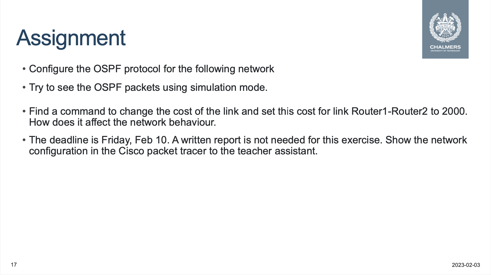
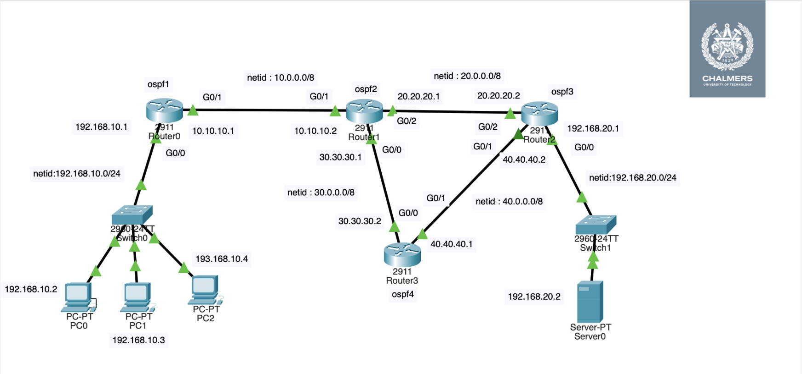

# EEN115_computer_exercises

## 1. OSPF configuration using Cisco Packet Tracer

### [OSPF](https://en.wikipedia.org/wiki/Open_Shortest_Path_First)

From wikipedia:

**Open Shortest Path First** (**OSPF**) is a [routing protocol](https://en.wikipedia.org/wiki/Routing_protocol) for [Internet Protocol](https://en.wikipedia.org/wiki/Internet_Protocol) (IP) networks. It uses a [link state routing](https://en.wikipedia.org/wiki/Link-state_routing_protocol) (LSR) algorithm and falls into the group of [interior gateway protocols](https://en.wikipedia.org/wiki/Interior_gateway_protocol) (IGPs), operating within a single [autonomous system](https://en.wikipedia.org/wiki/Autonomous_system_(Internet)) (AS).

### [Cisco Packet Tracer](https://www.netacad.com/courses/packet-tracer)

From wikipedia:

**Packet Tracer** is a [cross-platform](https://en.wikipedia.org/wiki/Cross-platform) visual [simulation](https://en.wikipedia.org/wiki/Simulation) tool designed by [Cisco Systems](https://en.wikipedia.org/wiki/Cisco_Systems) that allows users to create [network topologies](https://en.wikipedia.org/wiki/Network_topologies) and imitate modern [computer networks](https://en.wikipedia.org/wiki/Computer_networks). The software allows users to simulate the configuration of Cisco routers and switches using a simulated command line interface. Packet Tracer makes use of a [drag and drop](https://en.wikipedia.org/wiki/Drag_and_drop) user interface, allowing users to add and remove simulated network devices as they see fit. The software is mainly focused towards Cisco Networking Academy students as an educational tool for helping them learn fundamental [CCNA](https://en.wikipedia.org/wiki/CCNA) concepts. Previously students enrolled in a CCNA Academy program could freely download and use the tool free of charge for educational use.[[2\]](https://en.wikipedia.org/wiki/Packet_Tracer#cite_note-JOU-1-2)





### Cisco command note

### 1. interface

```
$Router>enable
$Router# configure terminal
Enter configuration commands, one per line. End with CNTL/Z. $Router(config)#
$Router(config)#interface GigabitEthernet0/0/0 
$Router(config-if)#ip address 10.10.10.1 255.0.0.0 
$Router(config-if)#no shutdown
$Router(config-if)#exit
```

### 2.ospf

```
$Router(config)# router ospf 1
$Router(config-router)# network 192.168.10.0 0.0.0.255 area 0 
$Router(config-router)# network 10.0.0.0 0.255.255.255 area 0


# delete ospf 
no router ospf <process number>


router ospf 1
 log-adjacency-changes
 network 10.0.0.0 0.255.255.255 area 0
 network 30.0.0.0 0.255.255.255 area 0
 network 20.0.0.0 0.255.255.255 area 0
```

### 3. save configuration

```
$Router# copy running-config startup-config
```

### 4.shows the configuration

```
$Router#show running-config
```

### 5.change cost for a link

```
Router(config)#interface GigabitEthernet 0/2
Router(config-if)#ip ospf cost 2000
Router(config-if)#exit

# Verification commands
sh ip ospf interface brief
```

### 6. routing table

```
Router#show ip route
Codes: L - local, C - connected, S - static, R - RIP, M - mobile, B - BGP
       D - EIGRP, EX - EIGRP external, O - OSPF, IA - OSPF inter area
       N1 - OSPF NSSA external type 1, N2 - OSPF NSSA external type 2
       E1 - OSPF external type 1, E2 - OSPF external type 2, E - EGP
       i - IS-IS, L1 - IS-IS level-1, L2 - IS-IS level-2, ia - IS-IS inter area
       * - candidate default, U - per-user static route, o - ODR
       P - periodic downloaded static route

Gateway of last resort is not set

     10.0.0.0/8 is variably subnetted, 2 subnets, 2 masks
C       10.0.0.0/8 is directly connected, GigabitEthernet0/1
L       10.10.10.2/32 is directly connected, GigabitEthernet0/1
     20.0.0.0/8 is variably subnetted, 2 subnets, 2 masks
C       20.0.0.0/8 is directly connected, GigabitEthernet0/2
L       20.20.20.1/32 is directly connected, GigabitEthernet0/2
     30.0.0.0/8 is variably subnetted, 2 subnets, 2 masks
C       30.0.0.0/8 is directly connected, GigabitEthernet0/0
L       30.30.30.1/32 is directly connected, GigabitEthernet0/0
O    40.0.0.0/8 [110/2] via 30.30.30.2, 00:01:05, GigabitEthernet0/0
O    192.168.10.0/24 [110/2] via 10.10.10.1, 00:04:10, GigabitEthernet0/1
O    192.168.20.0/24 [110/3] via 30.30.30.2, 00:01:05, GigabitEthernet0/0

Router#
```

## 2. RSA & DDos attack

### [RSA Algorithm](https://en.wikipedia.org/wiki/RSA_(cryptosystem))

The **RSA algorithm** is an asymmetric cryptography algorithm; this means that it uses a *public* key and a *private* key (i.e two different, mathematically linked keys). As their names suggest, a public key is shared publicly, while a private key is secret and must not be shared with anyone.

### [DDos](https://en.wikipedia.org/wiki/Denial-of-service_attack)

From wikipedia:

In [computing](https://en.wikipedia.org/wiki/Computing), a **denial-of-service attack** (**DoS attack**) is a [cyber-attack](https://en.wikipedia.org/wiki/Cyber-attack) in which the perpetrator seeks to make a machine or network resource unavailable to its intended [users](https://en.wikipedia.org/wiki/User_(computing)) by temporarily or indefinitely disrupting [services](https://en.wikipedia.org/wiki/Network_service) of a [host](https://en.wikipedia.org/wiki/Host_(network)) connected to a [network](https://en.wikipedia.org/wiki/Computer_network). Denial of service is typically accomplished by flooding the targeted machine or resource with superfluous requests in an attempt to overload systems and prevent some or all legitimate requests from being fulfilled.[[1\]](https://en.wikipedia.org/wiki/Denial-of-service_attack#cite_note-1)

### Task1

In this part, we plan to forget rsa library and try to implement RSA algorithm step by step. We want to cover the following topics:

- Generating RSA keys: We will learn how to generate a public and private key using Python.

- Encryption and Decryption: We will learn how to encrypt and decrypt a message using the RSA method.

### Task2

fix the Vulnerability in the system provided.
